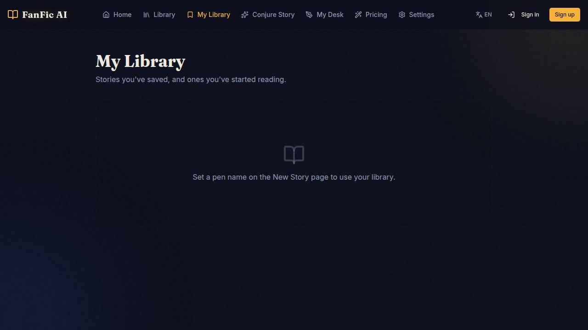
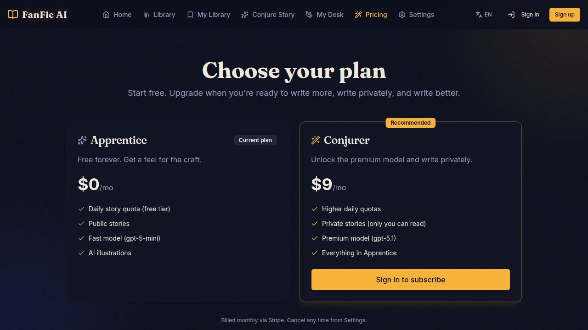

# FanFic AI

> AI‑powered fanfiction studio. Type a prompt, get a richly illustrated, narrated, branching story — with covers, audio, series, sharing and more.

[](https://github.com/agiilnl3/fanfic-ai-site/actions/workflows/ci.yml)

---

## Screenshots

| Home | My Library | Pricing |
| --- | --- | --- |
|  |  |  |

---

## What it does

- **Conjure stories** — GPT‑5.1 generates title, prose, summary and characters from a one‑line seed prompt
- **AI illustrations** — 3–4 inline images per story, generated in the chosen art style, plus a poster cover
- **Audio narration** — TTS of the full text with cached MP3 segments
- **Branching chapters** — Continue any story with new chapters or alternate branches
- **Series & My Desk** — Group stories into series, manage drafts, publish/unpublish
- **Public Library** — Searchable, filterable, virtualized feed of published stories with likes & comments
- **Sharing** — Dynamic OG images, poster covers, optional video trailers
- **Subscriptions** — Stripe‑powered Apprentice (free) and Conjurer ($9/mo) plans
- **Admin** — Moderation, metrics, feature‑flag toggles without redeploying
- **Reliability** — Sentry on API + web, GitHub Actions CI (lint, typecheck, integration, e2e), feature‑flag rollout

---

## Stack

- **Monorepo** — pnpm workspaces, TypeScript 5.9, Node 24
- **API** — Express 5, Drizzle ORM, PostgreSQL, Zod (`zod/v4`)
- **Frontend** — React 18, Vite 5, TanStack Query, wouter, shadcn/ui, Tailwind
- **AI** — OpenAI (GPT‑5.1, image, TTS, embeddings) via Replit AI proxy
- **Auth** — Clerk
- **Payments** — Stripe
- **Observability** — Sentry (API + web, source maps, user context, OpenAI tracing)
- **Storage** — Replit Object Storage for images, audio and trailers
- **Codegen** — Orval (`lib/api-spec/openapi.yaml` → React Query hooks + Zod schemas)

```
artifacts/
  api-server/        Express 5 API (port 8080)
  fanfic-ai/         React + Vite frontend
  mockup-sandbox/    Component preview server (design only)

lib/
  api-spec/          openapi.yaml — single source of truth
  api-zod/           Generated Zod validators
  api-client-react/  Generated TanStack Query hooks
  db/                Drizzle schema + client
  integrations-openai-ai-server/
```

---

## Quick start (local)

Prerequisites: Node 24, pnpm 9, PostgreSQL 16.

```bash
pnpm install
cp .env.example .env       # see "Environment" below
pnpm --filter @workspace/db run push
pnpm --filter @workspace/api-server run dev    # :8080
pnpm --filter @workspace/fanfic-ai   run dev    # :5173
```

Frontend dev server proxies `/api` → API server.

### Codegen

After editing `lib/api-spec/openapi.yaml`:

```bash
pnpm --filter @workspace/api-spec run codegen
```

### Tests

```bash
pnpm run lint
pnpm run typecheck
pnpm --filter @workspace/api-server run test     # vitest + supertest
pnpm --filter @workspace/fanfic-ai   run test:e2e # playwright
```

---

## Environment

| Variable | Required | Description |
| --- | --- | --- |
| `DATABASE_URL` | yes | Postgres connection string |
| `CLERK_SECRET_KEY` / `VITE_CLERK_PUBLISHABLE_KEY` | yes | Auth |
| `STRIPE_SECRET_KEY` / `STRIPE_WEBHOOK_SECRET` | yes | Billing |
| `ADMIN_PASSWORD` | yes | Admin token for `/api/admin/*` |
| `DEFAULT_OBJECT_STORAGE_BUCKET_ID` | yes | Replit Object Storage bucket |
| `PRIVATE_OBJECT_DIR` / `PUBLIC_OBJECT_SEARCH_PATHS` | yes | Object storage roots |
| `SENTRY_DSN` / `VITE_SENTRY_DSN` | optional | Error tracking |
| `VITE_PUBLIC_POSTHOG_KEY` | optional | Product analytics |

The OpenAI proxy is wired automatically by the Replit integration — no key needed.

---

## CI/CD

`.github/workflows/ci.yml` runs on every push:

1. Postgres service container
2. `pnpm install --frozen-lockfile`
3. `pnpm --filter @workspace/db run push`
4. `pnpm run lint`, `pnpm run typecheck`
5. API integration tests (vitest + supertest)
6. Build API + frontend
7. Upload Sentry source maps (gated on `SENTRY_AUTH_TOKEN`)
8. Boot API + frontend, run Playwright e2e

---

## Deploy

### Replit Deployments (recommended)

1. Open the project on Replit
2. Click **Publish**
3. Choose **Autoscale** for the API and **Static** for the built frontend, or **Reserved VM** for both
4. Add the env vars from the table above as Deployment Secrets
5. Build command: `pnpm run build`
6. Run command: `pnpm --filter @workspace/api-server start`
7. Health check: `GET /api/healthz`

The deployment automatically gets HTTPS, a `*.replit.app` domain, and a managed Postgres can be attached from the integrations panel.

### Self‑hosted (Docker / Render / Fly.io)

Build:

```bash
pnpm install --frozen-lockfile
pnpm run build
```

Run API:

```bash
node artifacts/api-server/dist/index.cjs
```

Serve the frontend (`artifacts/fanfic-ai/dist`) from any static host (Caddy, nginx, Cloudflare Pages). Point its `/api/*` to the API server.

A minimal Dockerfile:

```dockerfile
FROM node:24-alpine
WORKDIR /app
RUN corepack enable
COPY . .
RUN pnpm install --frozen-lockfile && pnpm run build
EXPOSE 8080
CMD ["node", "artifacts/api-server/dist/index.cjs"]
```

---

## Project structure conventions

- `lib/api-zod/src/index.ts` must only `export * from "./generated/api"` — extra exports break orval codegen
- Illustrations are stored as object‑storage URLs; render with ``
- Story generation uses `gpt-5.1` with `json_object` response format
- Feature flags: `/api/flags` (public), `/api/admin/flags*` (admin), `useFlag(name)` hook on the frontend

---

## License

Proprietary — all rights reserved.
